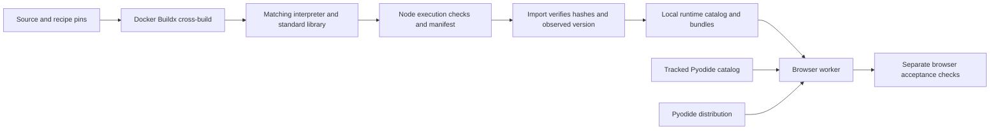
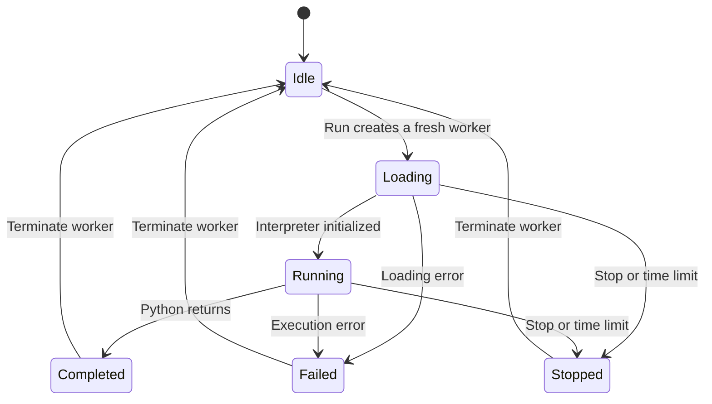

# Why the lab separates builds from browser execution

The builder produces interpreters; this repository consumes them as static assets. The server delivers files, and the selected Python runs inside a browser worker. This separation lets historical build systems change without changing the editor or requiring Python execution on the server. The [build tradeoffs](build-tradeoffs.md) explain the compiler side; the [playground interface](../../experiments/wasm/python/README.md) defines the browser contract.

The import boundary keeps a catalog entry tied to a complete build. It validates recorded evidence before copying files; it does not turn a Node pass into proof of browser compatibility. The [artifact reference](../reference/artifacts.md) owns bundle and catalog details, while the [validation reference](../reference/validation.md) explains what the checks establish. Rebuilding and importing are covered by the [rebuild guide](../how-to/rebuild.md).

## A worker belongs to one run

The [page controller](../../experiments/wasm/python/playground.mjs) owns worker termination. It can stop a tight Python loop even when that worker never returns to JavaScript. Its deadline includes downloading and initialization, so slow loading can consume the run's time allowance. Termination is immediate disposal, not a promise that Python cleanup handlers execute.

A fresh worker makes runs independent: Python globals, installed packages and the in-memory filesystem disappear with it. The cost is interpreter initialization and any package setup on every run; cached downloads do not retain interpreter state. A persistent application would need a different lifecycle and explicit state management. See [packages and applications](packages-and-applications.md).

## Streams and failures cross the boundary

The [worker adapter](../../experiments/wasm/python/worker.mjs) reports the interpreter's observed version, streams output, and sends completion or failure back to the page. Output is rendered as text in separate standard-output and standard-error panes. A shared output budget bounds accumulated text. Standard input returns end-of-file, so this is a script runner without an interactive terminal.

The Emscripten adapter uses line-oriented callbacks. The Pyodide adapter decodes stream bytes and flushes partial lines on success or exception because its interpreter stays alive until the page disposes of the worker. The Emscripten adapter preserves nonzero Python exit codes, including statuses older loaders would otherwise swallow. Loader faults and rejected Pyodide evaluations follow the execution-error path. Exact messages, limits and adapter options belong to the [interface reference](../../experiments/wasm/python/README.md).

A worker preserves page responsiveness; it does not supply a complete operating system or isolate hostile code from every browser permission. Host access depends on the selected runtime and its bridges. Importing a module alone cannot demonstrate that its host-dependent operations work. Those differences are explained in [runtime alternatives](runtime-alternatives.md).
