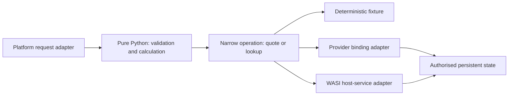

# Isolating complexity before isolating execution

A useful component boundary hides a decision the rest of the application should not need to understand. It might hide the edge provider, a database representation, a Python-version workaround or a native dependency. Separating files, processes or WebAssembly (Wasm) instances does not automatically produce that boundary.

[Parnas's 1972 modularisation paper](https://doi.org/10.1145/361598.361623) asks how decomposition affects comprehensibility and change. Applied here, the useful unit is a stable application operation, such as “quote an order”, rather than a sequence of framework setup steps. This application to the lab is a design recommendation, not a finding measured by our experiments.

## Three forms of separation

| Separation | What it contains | What it does not establish |
| --- | --- | --- |
| Information hiding | Knowledge of package, provider or representation choices | Protection against malicious code in the same interpreter |
| Capability boundary | Which external operations a guest can invoke | Bounded execution cost or correct business authorisation |
| Execution boundary | Memory and execution state under a runtime policy | Independence from shared hardware or host implementation bugs |

Python modules inside one interpreter are useful for organisation. They are not mutually distrusting tenants. WebAssembly System Interface (WASI) host adapters can expose granted resources. Component linking can create stronger boundaries, but only if the linked instances, shared resources and host grants implement the intended separation. See [isolation guarantees](isolation-guarantees.md).

The application owns meanings such as currency, quantity limits and retry safety. Adapters own mechanisms such as header conversion, resource handles and a provider's client library. A request identifier can cross those boundaries without exposing a database connection or private token.

## Choose the unit of deployment deliberately

A single component reduces interface calls and packaging coordination. It also places more dependencies, privileges and mutable state inside one failure boundary. Splitting components can make authority and replacement explicit, while adding adapters, data conversion, version negotiation and lifecycle work.

The right boundary depends on independent reasons to change and independent reasons to distrust. A stable, trusted calculation library may belong inside the application. A separately supplied parser with a narrow input/output contract is a stronger candidate for its own constrained instance. Splitting every function into a component creates obligations without necessarily reducing complexity.

A provider-specific capability can be confined behind a portable interface, but its semantics remain significant. Two key-value stores may disagree about consistency, transaction scope, limits or retries. Interface compatibility does not prove substitutability.

## Design the change experiment

Keep one route-independent operation and its contract tests unchanged. Replace only its adapter: fixture, local service, Cloudflare binding or compatible WASI host. Record which files, configuration and tests change. This measures the reach of a dependency more convincingly than counting abstraction layers.

Our existing [mock service probe](../how-to/probe-frameworks.md) and [real-service tutorial](../tutorials/external-service.md) supply two starting adapters. The edge labs establish separate platform entrypoints; they do not yet demonstrate one production framework application running unchanged across vendors.

The [packaging procedure](../how-to/package-edge-app.md) turns this decomposition into a reviewable artifact. The [measurement guide](../how-to/measure-edge-app.md) describes how to evaluate its costs.
