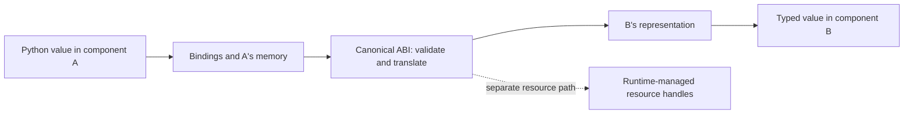

# Pointers, values and resource handles at a component boundary

A pointer meaningful inside one interpreter is not an address another component may safely dereference. This matters when deciding what an edge adapter should exchange: bytes and records, an opaque resource, or an accidental exposure of implementation memory.

## Linear-memory offsets have a context

For a conventional C or CPython build in WebAssembly (Wasm), a pointer typically becomes an offset in a particular linear memory. The pair **memory instance plus offset** identifies the bytes. The number `1024` alone does not identify a process address, a Python object or another instance's storage.

A load must remain inside the current memory bounds. It can still touch the wrong object inside those bounds: Wasm's boundary does not reconstruct C allocation ownership, prevent every use-after-free, or make an interpreter's extension code correct. The [memory experiment](../reference/isolation-lab.md) contrasts a trapped out-of-bounds load with an allowed neighbour overwrite.

Sharing a memory explicitly changes the boundary. Shared storage then needs compatible layout, synchronisation and trust assumptions. Two independent instances of the same module do not acquire shared memory merely because the binary bytes match.

## Typed values cross a different contract

The Component Model uses Wasm Interface Type (WIT) to express records, strings, lists, variants and functions. The Canonical ABI—application binary interface—describes **lifting** low-level representations into those values and **lowering** values into the callee's representation. [Canonical ABI specification](https://github.com/WebAssembly/component-model/blob/a25fc0b372dd21f07f0242c46e98bd0f1ea0c0e1/design/mvp/CanonicalABI.md).

Strings and lists can require validation, allocation and copying. The interface makes representation rules explicit; it does not promise zero-copy transfer. Large nested inputs therefore need size limits at the receiving boundary as well as a valid type. Wasmtime's [resource-allocation advisory](https://github.com/bytecodealliance/wasmtime/security/advisories/GHSA-852m-cvvp-9p4w) illustrates why valid typed inputs can still impose excessive host costs.

## Resource identity is not a raw pointer

A WIT resource represents something with identity and lifetime, such as a WASI 0.2 input-stream or filesystem descriptor. WASI 0.3 `stream<T>` and `future<T>` instead are Canonical ABI values; they are not WIT resources. Here WASI means WebAssembly System Interface. `own<T>` transfers ownership; `borrow<T>` grants temporary access under the interface's borrowing rules. The runtime and bindings manage the representation; applications should not invent numeric identifiers and assume they grant equivalent access. [WIT resource semantics](https://component-model.bytecodealliance.org/design/wit.html#resources).

A resource handle is only as narrowly useful as the operations and authorisation behind it. A handle to “read this object's public metadata” differs from a handle to “query any database table”. Dropping a local handle also does not reverse an already completed remote operation.

For Python, object identity, reference counting and extension application binary interfaces remain interpreter concerns. Passing a `PyObject*` from one CPython build to another is not a portable component interface. Export a stable data contract or deliberately designed resource abstraction instead.

The [complexity explanation](complexity-isolation.md) describes where these boundaries help; [measurement](../how-to/measure-edge-app.md) determines whether their conversion and lifecycle costs suit the application.
