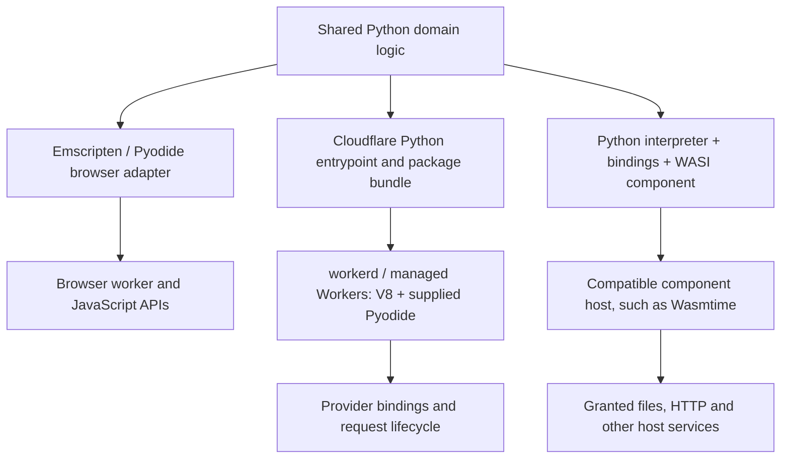

# How Python reaches an edge runtime without an application container

Yes: an application can ship as Python modules or a WebAssembly (Wasm) artifact and execute in an edge runtime without shipping a container image. That describes the application packaging boundary. It does not describe every process, operating system or infrastructure layer used by its host.

## Separate the three contracts

| Contract | Question |
| --- | --- |
| Artifact | Is this Python source, an Emscripten bundle, a core Wasm module, or a component? |
| Host interface | Which imports, request handler, resources and lifecycle does it require? |
| Deployment | Which platform accepts it, binds services and enforces limits? |

WebAssembly System Interface (WASI) defines host interfaces. An isolate is an execution boundary. Neither word identifies the complete packaging and deployment contract. The dated [platform matrix](../reference/edge-platforms.md) owns vendor support claims; the [interface reference](../reference/wasi-interfaces.md) distinguishes WASI generations.

These are alternative builds around shared application logic. The arrows do not imply interchangeable binaries.

## What transfers from this repository

Our browser CPython 2.7–3.15 builds target Emscripten. Their JavaScript loaders, filesystem bundles and entrypoints follow the [existing artifact contract](../reference/artifacts.md). Renaming their `.wasm` files or adding a component wrapper does not implement missing host imports, translate the filesystem model or produce an edge request handler.

A WASI packaging experiment therefore uses another interpreter/toolchain profile. The [WASI lab](../reference/wasi-edge-lab.md) records its actual Python version and component imports. The [Cloudflare lab](../reference/cloudflare-edge-lab.md) records the interpreter supplied by its pinned local runtime. Neither establishes edge support for all 17 historical interpreters.

Python applications can retain route-independent validation, transformations and business rules. Framework middleware, native extensions, sockets, subprocesses, filesystem assumptions and service clients need explicit adapters or replacement. [Framework support](../reference/framework-support.md) describes the browser probes; passing there is evidence for those probes alone.

## Portability has several levels

Source portability means code can be rebuilt for another target. Binary portability means the same artifact links and runs there. Behavioural portability additionally requires compatible state lifetime, errors, cancellation and external-service semantics. Operational portability includes deployment, identity, observability and quotas.

A component can improve the binary/interface boundary while a proprietary database binding still couples the application to its provider. Keeping that binding behind a narrow application interface confines the dependency without pretending it disappears. This is the design argument developed in [complexity isolation](complexity-isolation.md).

A container may still be convenient for a reproducible compiler environment. Using Docker Buildx during preparation does not require running the resulting application inside a container. Conversely, distributing a Wasm artifact through an Open Container Initiative registry does not by itself determine its execution model.

Use [the packaging procedure](../how-to/package-edge-app.md) to choose and verify a target. The three runnable labs and [research reading list](../reference/edge-reading.md) support deeper investigation.
