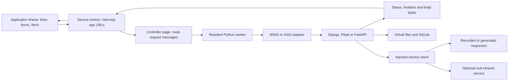

# How a Python framework could serve a browser playground

A Python framework can process a request without opening a listening socket. Its routes, middleware and response generation still run; a browser adapter supplies the request instead of a network server. This makes Flask, Django and FastAPI candidates for an application playground, subject to their dependencies and execution paths.

## The WordPress Playground comparison

[WordPress Playground](https://developer.wordpress.org/playground/developers/architecture/browser-concepts/) combines an iframe, a service worker and a PHP worker. Requests from the iframe become messages to the runtime, and its responses become browser responses. Keeping the controlling page outside the iframe preserves its worker while the application navigates.

The analogous design below is **proposed for this lab, not implemented**:

The browser still fetches the initial page and runtime assets from a static host. Virtual application addresses are routed after initialization. Service workers need a secure context, normally HTTPS or localhost, and have browser-controlled lifetimes; the interpreter belongs in the page-owned worker, with explicit recovery after reload. [Service-worker lifecycle](https://developer.mozilla.org/en-US/docs/Web/API/Service_Worker_API/Using_Service_Workers).

## Two interfaces cover the frameworks

Flask and Django expose the Web Server Gateway Interface (WSGI): a synchronous callable receives an environment and returns response bytes. FastAPI exposes the Asynchronous Server Gateway Interface (ASGI): a callable receives a request scope and asynchronous receive/send functions. Django also supports ASGI, but its synchronous components can introduce thread requirements. These are [application protocols](../reference/framework-support.md), not promises that all framework features work in WebAssembly.

For a first experiment, framework test clients or HTTPX transports can supply this boundary inside one run. A navigable site needs the [proposed browser bridge](../reference/framework-bridge.md) to retain the application and handle multiple requests. The current [worker lifecycle](architecture.md) ends after each script, so it cannot preserve a logged-in application between Run clicks.

## Inbound routing and outbound services are separate

Intercepting a form submission into Django does not make Django's outbound database, mail or HTTP libraries browser-compatible. Inject a fixture-backed client for demonstrations, or bridge supported operations to browser fetch and an internal service. HTTPX's [mock transport](https://www.python-httpx.org/advanced/transports/#mock-transports) can return realistic status codes, headers and bodies while still exercising the calling application code.

WordPress's outbound networking uses additional runtime-specific [fetch and socket shims](https://github.com/WordPress/wordpress-playground/blob/2c2473a4ed80f871d93cb9316f6e4807af216e55/packages/php-wasm/web/src/lib/tcp-over-fetch-websocket.ts); copying its service-worker pattern alone does not supply Python socket semantics. Redis, PostgreSQL connections, task workers and arbitrary subprocesses remain separate integration decisions.

## What fidelity costs

Buffered requests are enough for many form and JSON demonstrations. Streaming, cancellation, WebSockets, file uploads and concurrent requests each add protocol and lifecycle work. Cookies require an explicit design; a synthetic response is not automatically a browser-managed login session. SQLite can model useful local application state, but does not reproduce a production database engine.

The measured [framework results](../reference/framework-support.md) distinguish tested request paths from these proposed capabilities. The [closed-network guide](../how-to/deploy-offline.md) covers distributing their runtime and package assets locally.
