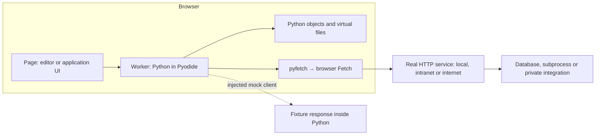

# Why a WebAssembly application still needs host services

WebAssembly (Wasm) executes code inside a host. The host supplies access to the outside world; compiling Python does not itself provide a network stack, a database server or an operating system. Wasm's [import and execution model](https://webassembly.github.io/spec/core/exec/index.html) separates module execution from host functions.

## Three places where work happens

The [runnable service tutorial](../tutorials/external-service.md) crosses the solid network boundary using Hypertext Transfer Protocol (HTTP). The earlier [framework fixture](../how-to/probe-frameworks.md) exercises application code through the dotted boundary. A convincing response body alone cannot tell you which path ran; browser and service logs can.

An external service is external to the interpreter, not necessarily to your organisation. A browser and an internal server can exchange requests with no internet access. The [distribution inventory](../reference/network-dependencies.md) is a separate concern: interpreter and package downloads must also remain internal.

## Choose where each capability belongs

| Boundary | Useful for | What it costs |
| --- | --- | --- |
| Python function and local fixture | Deterministic tests, disconnected demonstrations | Does not test browser access or a real service |
| Browser Fetch to a service | Shared data and supported HTTP operations | Network latency, availability and browser policy |
| Same-origin gateway to private services | Central credentials and controlled integration | A deployed server, operational ownership and another request hop |
| Native capability ported into Wasm | Client-side processing without that service | Compilation, compatible dependencies, memory and download cost |

Browser networking follows browser rules even when the caller is Python. [Pyodide's HTTP API](https://pyodide.org/en/stable/usage/api/python-api/http.html) provides a bridge to Fetch. It does not make an arbitrary socket-based Python client interchangeable with a browser client. The [runtime comparison](runtime-alternatives.md) explains why a WebAssembly System Interface (WASI) host is a different integration choice.

## Keep authority on the server

Downloaded Python, JavaScript and Wasm are inspectable by the person running the browser. A private service credential placed there is delivered to that person. A gateway can retain privileged credentials while authenticating users and authorising a narrow set of operations. Origin permission and user permission answer different questions.

A service can also retain state across lab runs while the [disposable Python worker](architecture.md) cannot. This makes the service useful for shared state, but creates distributed failure cases: the browser might time out after the server has completed a write. Retrying a payment or job submission needs an application-level operation identifier or another deduplication contract; cancelling Fetch is insufficient.

## Inbound and outbound remain separate

Calling an external service is outbound work from Python. Making Django or Flask respond to browser navigation is inbound routing into Python. A working Fetch client does not install the [proposed application bridge](../reference/framework-bridge.md), and a service worker that intercepts navigation does not automatically adapt every outbound library.

The [connection guide](../how-to/connect-service.md) turns these choices into a deployment procedure. The [learning path](../learning-path.md) connects them to compilation, packaging and verification.
