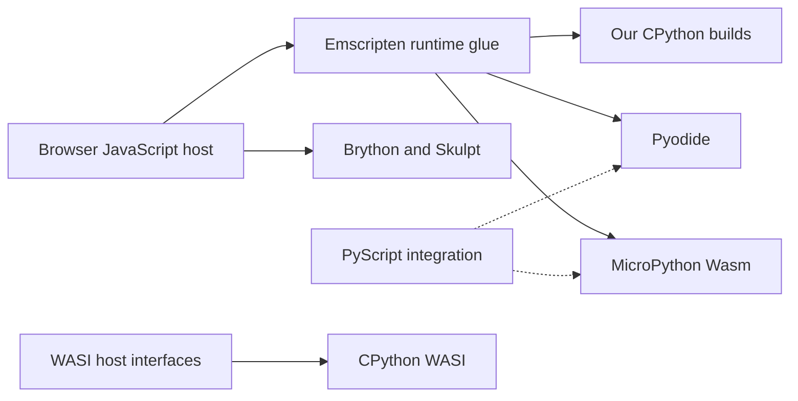

# Why Python runtimes cover different needs

Running Python through WebAssembly (Wasm) does not identify a complete application platform. Interpreter semantics, the host interface and application integration are separate choices. This lab uses CPython, Python's reference implementation, to compare historical language behavior. Its pinned Pyodide baseline tests a richer browser platform. Exact versions, measured modules and validation results belong in the [runtime reference](../reference/runtimes.md); the baseline is a recorded comparison, not a claim about the latest release.

| Option | What it provides | Evidence in this lab |
| --- | --- | --- |
| Our CPython Emscripten builds | Version-family ports with a matching standard library and JavaScript loader | Built from source and tested in Node.js and browsers; scope is in the runtime reference |
| [Pyodide](https://pyodide.org/en/stable/) | CPython distribution with Python/JavaScript interoperability and a package ecosystem | Pinned upstream distribution tested with interpreter and application examples |
| [Upstream CPython Emscripten](https://github.com/python/cpython/blob/main/Platforms/emscripten/README.md) | Upstream cross-build support for JavaScript hosts | Foundation for modern recipes; upstream defaults are not a separately validated lab profile |
| [Upstream CPython WASI](https://github.com/python/cpython/blob/main/Platforms/WASI/README.md) | CPython targeting the WebAssembly System Interface (WASI) | Researched; no WASI artifact tested here |
| [MicroPython Wasm](https://github.com/micropython/micropython/blob/master/ports/webassembly/README.md) | A different Python implementation, with an Emscripten port and JavaScript bridge | Researched; not built or tested here |
| [PyScript](https://docs.pyscript.net/2026.7.2/user-guide/what/) | Browser integration around Pyodide or MicroPython, including interpreter loading and browser interaction | Researched; not an additional interpreter or a tested lab adapter |
| [Brython](https://github.com/brython-dev/brython) and [Skulpt](https://github.com/skulpt/skulpt) | Python implementations running through JavaScript, with their own compatibility surfaces | Researched; not CPython Wasm artifacts or substitutes for testing exact CPython releases |

The local historical ports do not imply that upstream CPython or Pyodide supports the same version range. MicroPython deliberately implements a smaller Python environment; sharing Python syntax does not establish CPython standard-library or extension compatibility. [MicroPython's description](https://github.com/micropython/micropython) makes that implementation boundary explicit.

Arrows show hosting or integration, not interchangeable binaries. Emscripten supplies JavaScript runtime support; browser capabilities still depend on the host and exposed bridges. WASI standardizes interfaces supplied by a compatible host, which may itself be implemented in a browser. It is not an automatic bridge to browser objects. Both routes have host-dependent restrictions on processes, files and networking. [WASI introduction](https://wasi.dev/), [CPython platform limitations](https://docs.python.org/3/library/intro.html#webassembly-platforms).

The lab's Emscripten adapter expects a JavaScript factory and associated runtime files. Selecting that adapter cannot load an arbitrary WASI command or component; a suitable WASI host adapter would be additional work. That boundary is defined by the [artifact contract](../reference/artifacts.md), rather than the `.wasm` extension.

For application tradeoffs, see [packages and applications](packages-and-applications.md). The [guided examples](../../experiments/wasm/python/LAB-NOTES.md) teach the tested combinations without treating researched alternatives as completed integrations.
