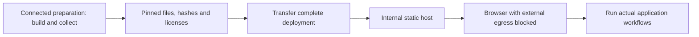

# Prepare a lab for a network without internet access

Build a complete deployment on a connected preparation machine, transfer it to the intranet, then test with external requests blocked. Use the [network reference](../reference/network-dependencies.md) as the artifact inventory.



## Assemble the runtimes

Follow the [publishing guide](publish.md). Imported CPython bundles already use local asset addresses. For a deployment offering only those runtimes, set the staged baseline `runtimes.json` to `{"schemaVersion":1,"runtimes":[]}` and retain the local catalog. This removes the internet-backed Pyodide choice.

To include Pyodide, obtain the full `pyodide-314.0.7.tar.bz2` archive from the [pinned release](https://github.com/pyodide/pyodide/releases/tag/314.0.7). Extract its distribution contents into `experiments/wasm/python/vendor/pyodide/314.0.7/` in the staged deployment. Verify that `pyodide.mjs` is directly inside that directory. Preserve the complete matching distribution and notices; the smaller core archive does not contain every optional package. See [upstream deployment documentation](https://pyodide.org/en/stable/usage/downloading-and-deploying.html).

Add this entry to the staged `runtimes.local.json` array, preserving its CPython entries:

```json
{
  "id": "pyodide-314.0.7",
  "label": "Pyodide 314.0.7 · intranet",
  "adapter": "pyodide",
  "module": "./vendor/pyodide/314.0.7/pyodide.mjs",
  "description": "Self-hosted distribution; application dependencies supplied locally."
}
```

The matching ID replaces the baseline entry. Check the merged selector and requested addresses after staging.

## Supply the application dependency set

Collect the project's compatible wheels, every transitive dependency and required data while connected. Resolve for the target Pyodide environment; a desktop installer can select incompatible native wheels or different conditional dependencies. Record filenames, versions, source addresses, hashes and licenses alongside the deployment. [Stage project source and fixtures](import-project.md) separately.

For an explicit wheel set, enable micropip, leave the requirements box empty, and keep automatic import loading off. Install the complete set in your bootstrap with dependency resolution disabled:

```python
import micropip
from js import URL, location

wheel_names = ["myproject-1.0.0-py3-none-any.whl"]
wheel_urls = [
    str(URL.new("./wheels/" + name, location.href).href)
    for name in wheel_names
]
await micropip.install(wheel_urls, deps=False)
```

Replace the illustrative filename with your artifacts under the playground's `wheels/` directory. Include dependencies in that list, or explicitly load their matching mirrored Pyodide packages first. `deps=False` prevents dependency discovery; it does not make omitted dependencies available. Install wheels through micropip rather than renaming desktop binaries.

Alternatively, provide a compatible internal package index and use `index_urls=["https://packages.intranet.example/simple"]` in your Python installation call. Mirror its linked wheel files too and check every redirect. The [index behavior reference](../reference/network-dependencies.md) describes the supported formats.

Replace the Datasette example's own `micropip.install(requirements)` call with your local installation bootstrap; changing the checkbox alone leaves that download path intact.

## Transfer and verify

Transfer the whole staged tree and verify recorded hashes at the destination. If rebuilding or testing inside the closed network, separately provision container images, build inputs, package caches and the matching Playwright browser. This guide prepares browser execution; it does not make the builder hermetic.

Run [external-request checks](verify-no-egress.md) on a cold browser, then exercise real application paths under the intranet's actual network controls. Diagnose failures with the [intranet guide](debug-intranet.md).
