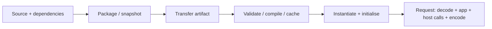

# Measure an edge application without confusing the layers

Define the claim before collecting timings: startup overhead, steady request latency, throughput, memory, interface conversion or portability. A local response proves functionality; it does not establish global edge latency or provider economics.

## Hold the useful work constant

Choose a representative input/output contract and verify it in every candidate. Keep dependency versions, dataset, validation and error handling equivalent. Compare our Cloudflare and WebAssembly System Interface (WASI) fixtures only after accounting for their different interpreters, packages and lifecycle policies in the [lab references](../reference/edge-platforms.md).

Use a small matrix: payload size, dependency weight, concurrency and state model. Include invalid input and a slow external-service fixture. Record the source revision, artifact hash, runtime, host processor/operating system, power settings and network path.

## Separate preparation from requests

Measure each observable phase separately. If the platform hides a phase, label it unobserved rather than assigning it zero. Record cold process, cold instance and warm request results separately; restarting a client does not necessarily make a server cold.

Distinguish artifact bytes, compressed transfer bytes, guest linear memory and host process resident memory. A platform-supplied interpreter can make an upload small without making its execution footprint equally small. Shared process memory cannot automatically be attributed to one isolate.

## Collect distributions and failure data

Use a monotonic clock outside the guest for end-to-end measurements. Some runtimes deliberately restrict guest clocks. Run repeated independent trials, randomise candidate order and keep warm-up results separate. Report sample count, median, tail percentiles, variability and all timeouts/errors; do not discard slow failures to improve latency figures.

Use an arrival-rate-controlled load generator when testing saturation so delayed responses do not silently reduce offered load. Record queue time, active concurrency, throughput and rejection rate. Set an explicit maximum load and stop condition for the test environment.

For component boundaries, vary transferred bytes and call count independently. Measure a comparable in-process function and a no-op adapter to separate computation from conversion. For instance policies, compare fresh instances with reuse under the same reset and tenant-isolation requirements.

## State what the result supports

A local Wasmtime number describes that host and configuration. A local workerd number does not establish Cloudflare scheduling, regional routing, account limits or billing. A hosted evaluation needs the real deployed revision, region, service bindings, quota tier and network measurements.

Historical research such as [Jangda et al., 2019](https://www.usenix.org/conference/atc19/presentation/jangda) is useful for experimental design, not a current universal slowdown factor. Runtime, compiler and workload changes require new measurements.

Publish the harness, raw observations and a concise evidence summary. Separate observed facts, inferred causes and untested hypotheses. The [research questions](../reference/edge-research-questions.md) provide bounded follow-on studies; no comparative performance result is claimed by the current functional labs.
