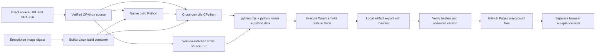
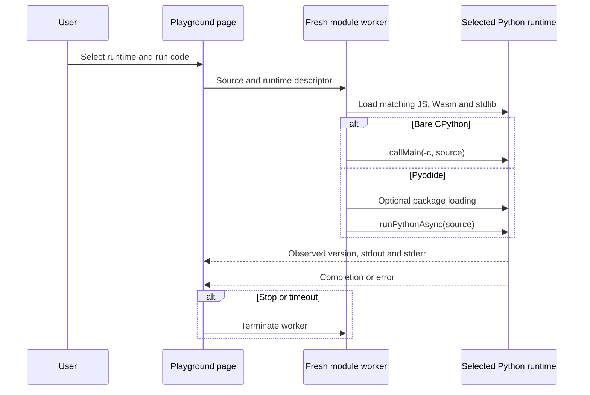

# How the builder and browser lab fit together

## Build platform and runtime target are different choices

`docker buildx` runs the compiler in a Linux container. The container may be
Linux/arm64 on an Apple Silicon host, or Linux/amd64 for an older SDK that only
ships that image. The compiler's output target is `wasm32-emscripten` in both
cases. Setting a Docker container platform does not itself compile Python to
WebAssembly.

The oldest CPython builds can sometimes use release-generated files and avoid
a native build interpreter. That is a family-specific implementation choice,
not a reason to remove the native generation stage from modern Python.

## Branches preserve the historical build model

The shared interface is the exported artifact, not one enormous configure
script. The modern family uses upstream Emscripten support and a current
compiler. The older upstream family uses earlier `Tools/wasm` helpers and
different linking flags. Legacy branches own their configure probes, static
module lists, and any generated-loader adaptation.

When recipes have passed execution checks, preserve each family in its own Git
branch and record the commit SHA used by the build. A moving branch name is a
convenient development selector; a commit SHA is the reproducibility input.
The source lock and artifact schema can be carried between branches without
forcing historical source patches into a shared conditional script.

## The lab uses adapters, not interchangeable binaries

The basic bare-CPython adapter runs one script per interpreter instance.
Pyodide has a richer supported embedding API and can support asynchronous
Python-to-JavaScript interaction. Selecting a different adapter does not make
the underlying ABIs or wheel packages compatible.

## Feature boundaries

| Feature | Build-time decision | Runtime/app decision |
| --- | --- | --- |
| Interpreter version | CPython source and toolchain pins | Select a complete matching artifact set |
| Pure stdlib modules | Which source files to package | Import an included module |
| C stdlib modules | Static modules and target-library dependencies | Import succeeds only if built |
| SQLite | Compile the binding and SQLite for the target | Open a MEMFS database; add persistence separately |
| Threading | Wasm pthread compilation and memory model | Host worker support and cross-origin isolation |
| Native extensions | Compatible dynamic-linking ABI and compiled wheels | Pyodide or another loader loads matching binaries |
| Pure Python packages | Can be prebundled with compatible dependencies | Optional micropip/network install in Pyodide |
| pip | Including its files alone is insufficient | Requires compatible networking, packaging and installation behavior |
| Filesystem persistence | Optional filesystem backend/glue | Explicitly mount and synchronize browser storage |
| App HTTP requests | Browser network bridge or in-process app adapter | Fetch remote data, or invoke ASGI-style application requests |

These are capability boundaries, not security permissions. For example,
turning off the lab's package-install checkbox avoids that automatic install
step; it is not a claim that arbitrary Python code cannot access a runtime's
network bridge.

## Rebuild and distribution checks

1. Verify the source checksum before extraction.
2. Compile using the recorded SDK image and family recipe.
3. Check actual Wasm magic, interpreter version, execution, imports, and files.
4. Record hashes of the runtime files and preserve licenses.
5. Export only matching runtime/data/loader files to the site.
6. Test in a browser independently of Node.

For stronger reproducibility, snapshot host-package repositories, preserve
recipe commit hashes in manifests, build twice from empty caches, and compare
each artifact. A successful cached build proves that recipe execution worked;
it does not establish byte-for-byte reproducibility.
