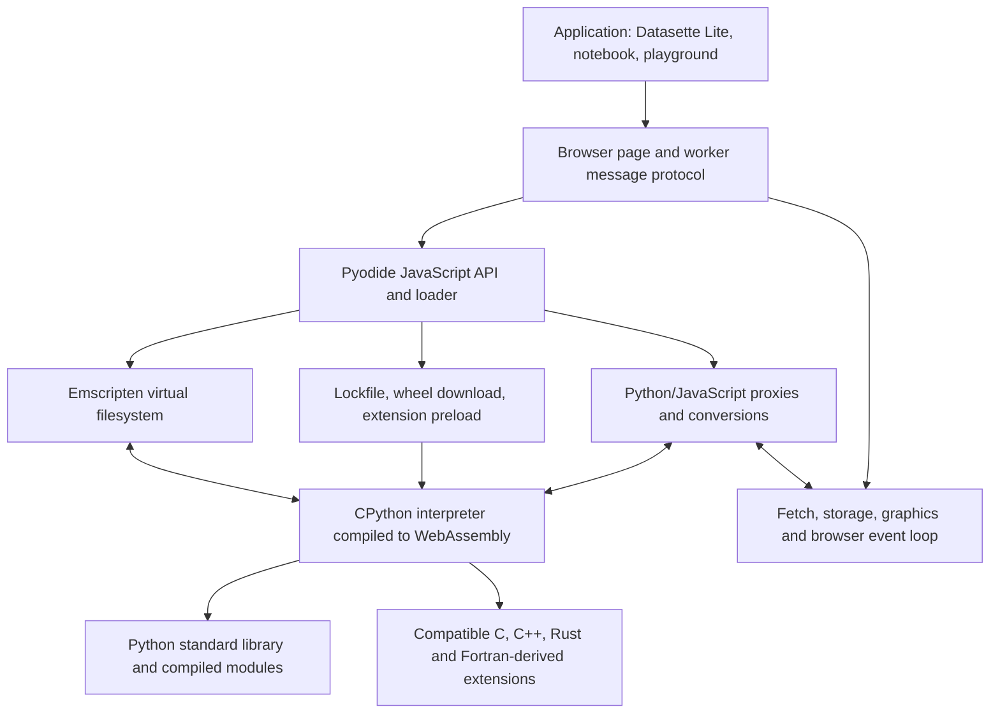
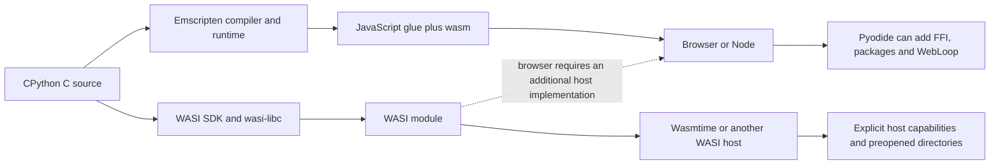
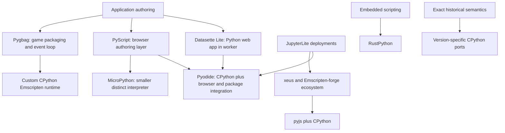
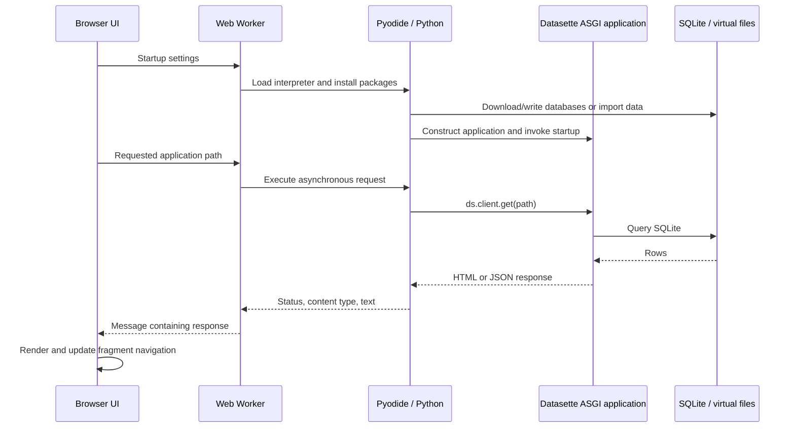
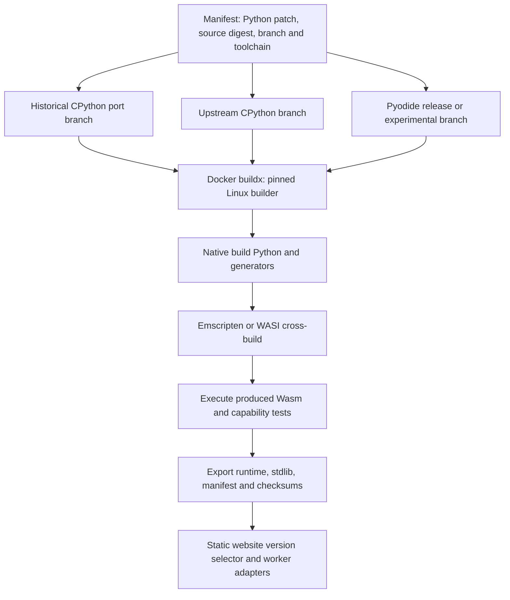

# Python in WebAssembly: technical teardown and version strategy

Research snapshot: **29 September 2026**. “Piodide” is interpreted as **Pyodide**. This report records upstream source and documentation evidence. It does **not** claim that inspecting a recipe, downloading a release, or finding an old port proves a successful local build. Local build and execution results must be recorded separately.

The useful division is between **faithful historical CPython interpreters** and **a browser application platform**. Pyodide supplies much of the latter, but its historical releases cover only part of the requested interpreter range. For Python 2.7 and early Python 3, a small Emscripten CPython port is the practical starting point; replicating the entire modern Pyodide package ecosystem would be a separate, substantially larger project.

## 1. What Pyodide actually adds

CPython still parses Python, creates bytecode, and interprets that bytecode. Compiling CPython to Wasm does not ahead-of-time compile the user's Python program. Pyodide surrounds that interpreter with a JavaScript loader, virtual filesystem, Python/JavaScript object bridge, event-loop integration, and a compatible extension-package ecosystem. Upstream CPython's Emscripten build supplies a lower-level executable; PEP 776 explicitly distinguishes these products. [PEP 776](https://peps.python.org/pep-0776/)

The `.wasm` file is only part of the deliverable. An Emscripten executable depends on its JavaScript runtime glue, import implementations, and data files. The loader establishes the filesystem and standard-library location before initialization. For example, upstream CPython supports mounting its stdlib through NodeFS in Node, or placing a stdlib ZIP in the browser filesystem. Changing Python versions without replacing the corresponding stdlib is invalid. [CPython Emscripten embedding instructions](https://github.com/python/cpython/blob/main/Platforms/emscripten/README.md)

The tagged Pyodide 314.0.7 build uses a 30 MiB initial linear memory, allows growth up to a configured 4 GiB, and has a 10 MiB Wasm stack. These are configuration limits, not a promise that every browser can allocate that much memory. Its main module links SQLite, libffi, compression libraries, and browser integration libraries. It exports runtime and CPython functions required by the bridge and dynamic loader. **A custom minimal interpreter can be much smaller precisely because it does less.** [314.0.7 build configuration](https://github.com/pyodide/pyodide/blob/314.0.7/Makefile.envs)

## 2. The version coverage that upstream evidence supports

These are selected, verified **source pins**, not a claim to enumerate every historical Pyodide release. The Python and compiler versions were read directly from each tagged `Makefile.envs`.

| Requested CPython minor | Concrete Pyodide source evidence | Python patch / Emscripten | Interpretation |
| --- | --- | --- | --- |
| 2.7 | No Pyodide release identified | Separate port required | EmCPython is a historical patch lead, with asm.js output |
| 3.0 | No Pyodide release identified | Separate port required | Must validate independently |
| 3.1 | No Pyodide release identified | Separate port required | Must validate independently |
| 3.2 | No Pyodide release identified | Separate port required | Must validate independently |
| 3.3 | No Pyodide release identified | Separate port required | Must validate independently |
| 3.4 | No Pyodide release identified | Separate port required | Must validate independently |
| 3.5 | No Pyodide release identified | Separate port required | Must validate independently |
| 3.6 | No Pyodide release identified | Separate port required | Must validate independently |
| 3.7 | [0.15.0](https://github.com/pyodide/pyodide/blob/0.15.0/Makefile.envs) | 3.7.4 / 1.38.30 | Historical Pyodide source |
| 3.8 | [0.17.0](https://github.com/pyodide/pyodide/blob/0.17.0/Makefile.envs) | 3.8.2 / 2.0.15 | Historical Pyodide source |
| 3.9 | [0.18.1](https://github.com/pyodide/pyodide/blob/0.18.1/Makefile.envs) | 3.9.5 / 2.0.16 | Historical Pyodide source |
| 3.10 | [0.22.1](https://github.com/pyodide/pyodide/blob/0.22.1/Makefile.envs) | 3.10.2 / 3.1.27 | Historical Pyodide source |
| 3.11 | [0.25.1](https://github.com/pyodide/pyodide/blob/0.25.1/Makefile.envs) | 3.11.3 / 3.1.46 | Historical Pyodide source |
| 3.12 | [0.27.7](https://github.com/pyodide/pyodide/blob/0.27.7/Makefile.envs) | 3.12.7 / 3.1.58 | `2024_0` ABI |
| 3.13 | [0.29.5](https://github.com/pyodide/pyodide/blob/0.29.5/Makefile.envs) | 3.13.2 / 4.0.9 | `2025_0` ABI |
| 3.14 | [314.0.7](https://github.com/pyodide/pyodide/blob/314.0.7/Makefile.envs) | 3.14.2 / 5.0.3 | Stable Pyodide family at research date |
| 3.15 | [experimental branch pinned at c47e555](https://github.com/pyodide/pyodide/blob/c47e5552a0435764884c0b3ad991486a08c89b1d/Makefile.envs) | 3.15.0rc1 / 6.0.5 | Identifies itself as 315.0.0a2; source candidate, not a validated release here |

The inspected Pyodide `0.1.0` and `v0.1.0` tags both target Python 3.7.0. This investigation found no upstream Pyodide route for 2.7–3.6; that is an evidence boundary, not a proof that nobody has ever built one. [0.1.0 configuration](https://github.com/pyodide/pyodide/blob/0.1.0/Makefile.envs)

Python 3.15 is still a prerelease on the research date: rc2 was released on 1 September, and final is scheduled for 1 October 2026. A reproducible upper-bound build should identify `3.15.0rc2`, or the exact experimental Pyodide commit, rather than silently calling either one “3.15 final.” [Release schedule](https://peps.python.org/pep-0790/)

There are **different valid compiler pins for different products**: upstream CPython `v3.15.0rc2` specifies Emscripten **4.0.19**, Node **24**, libffi **3.4.6**, and mpdecimal **4.0.1**. The prospective Pyodide 3.15 platform specifies Emscripten **6.0.5**. Substituting one for the other changes the product being built. The experimental Pyodide commit also has `PYVERSION_GHA=3.15.0b4`, which deserves review before trusting its CI path. [CPython rc2 configuration](https://github.com/python/cpython/blob/v3.15.0rc2/Platforms/emscripten/config.toml), [planned Pyodide 3.15 platform](https://pyodide.org/en/stable/development/abi/315.html)

## 3. Browser Emscripten and WASI cover different surfaces

Wasm is the instruction format; Emscripten and WASI are different runtime contracts around it. A browser's `WebAssembly.instantiate` does not supply WASI imports automatically. Conversely, a WASI engine does not supply Emscripten's JavaScript filesystem, DOM bridge, or Pyodide package loader. A file with a `.wasm` suffix does not establish interchangeability.

| Surface | Pyodide in browser | Upstream CPython Emscripten | CPython WASI |
| --- | --- | --- | --- |
| Main host | Browser/worker; also Node | Browser or JavaScript runtime | WASI runtime |
| Standard CPython semantics | Yes, subject to platform limitations | Yes, subject to build configuration | Yes, subject to host capabilities |
| JS object bridge | Rich supported public API | Embedding glue must be supplied | No intrinsic browser bridge |
| Package product | Wheels, lockfile, loader, micropip | No equivalent bundled package platform | Package/storage strategy belongs to distribution |
| Files | Emscripten mounts | Emscripten mounts | Host grants/mapped directories |
| HTTP | Browser Fetch/XHR adapters | Must provide suitable adaptation | Depends on WASI version, host and Python integration |
| Native extension binary | Matching Emscripten/Python ABI | Static by default; dynamic support needs care | Cannot reuse Emscripten wheels |
| Browser UI | Through JS, or page/worker messages | Your embedding API | Requires browser host/adapters |

The table is an engineering synthesis of the platform documentation, not a benchmark. CPython's current guide documents a two-stage cross-build: first a native build Python, then the Wasm interpreter. Its helper path changes across releases: `Tools/wasm/wasi.py` for 3.13, `Tools/wasm/wasi` for 3.14, and `Platforms/WASI` for 3.15+. These differences justify version-family branches. [CPython build guide](https://devguide.python.org/getting-started/setup-building/)

WASI entered CPython's tier 3 support for 3.11/3.12 and tier 2 for 3.13. PEP 816 records WASI 0.1 / SDK 21 for 3.11–3.12 and SDK 24 for 3.13–3.14. It also explicitly documents problematic SDK 26/27 and an intention to skip WASI 0.2. This is why “latest wasi-sdk” is an unsuitable reproducibility pin. [PEP 816](https://peps.python.org/pep-0816/)

## 4. Other Python runtimes and application layers

| Project | What it supplies | Relevance to exact 2.7–3.15 coverage |
| --- | --- | --- |
| [MicroPython WebAssembly port](https://github.com/micropython/micropython/blob/master/ports/webassembly/README.md) | Small Python implementation, `.mjs`/`.wasm`, JS bridge, synchronous/async execution | Useful size/startup comparison; not an exact historical CPython implementation |
| [RustPython](https://github.com/RustPython/RustPython) | Interpreter written in Rust; browser Wasm demo and documented `wasm32-wasip1` build | Embedding alternative; its current Python-3 compatibility goal is not a matrix of CPython minors |
| [Emscripten-forge](https://emscripten-forge.org/) | Conda-style package distribution for Emscripten | Alternative package ecosystem, not automatic compatibility with Pyodide wheels |
| [pyjs](https://github.com/emscripten-forge/pyjs) | CPython/JavaScript bindings built with pybind11 and Embind | Comparable FFI surface; package/compiler family must be pinned |
| [pygbag](https://github.com/pygame-web/pygbag) | CPython + pygame-oriented browser runtime and app packager | Valuable game/SDL surface; not an all-version builder |
| [PyScript](https://docs.pyscript.net/2026.1.1/beginning-pyscript/) | Web application authoring over Python runtimes | Application layer; selecting a runtime cannot create missing CPython versions |
| [EmCPython](https://github.com/PeachPy/EmCPython) | Historical Emscripten CPython 2.7 port | Patch archaeology; README's artifact is `python.asm.js`, not evidence of Wasm |
| [empythoned](https://github.com/replit-archive/empythoned) | Historical CPython-to-JavaScript build | Further porting clues; no validated modern Wasm artifact established here |

MicroPython exposes `loadMicroPython`, `runPython`, `runPythonAsync`, a filesystem, globals, and JS module registration. API resemblance can support an adapter, but standard-library and language differences remain. Running a MicroPython interpreter labelled “Python 3” would not satisfy a request for CPython 3.0 or 3.15 behavior. [MicroPython port API](https://github.com/micropython/micropython/blob/master/ports/webassembly/README.md)

RustPython's current README describes Python 3.14+ compatibility aspirations, documents a WASI build with frozen stdlib, and says the interpreter is still in development. Its native pip/SSL instructions must not be assumed to work unchanged in its browser build. [RustPython source README](https://github.com/RustPython/RustPython/blob/main/README.md)

The inspected Emscripten-forge Python recipe currently targets **3.14.3**, separates static libpython, runtime, and development packages, and carries architecture-specific patches. This is particularly useful evidence for separating host build dependencies from target libraries. Its recipe is a source lead, not a locally tested artifact in this report. [Python recipe](https://github.com/emscripten-forge/recipes/blob/main/recipes/recipes_emscripten/python/recipe.yaml)

Pygbag explicitly states that Pyodide wheels are not compatible out of the box. Its runtime is CPython, with its own SDK, loader, SDL/game integration and distribution. Its documented application loop yields with `await asyncio.sleep(0)` so rendering can progress. That is a useful comparison with an application such as Datasette whose main activity is a sequence of requests. [Pygbag README](https://github.com/pygame-web/pygbag/blob/main/README.md)

The diagram shows product boundaries, not exclusive capabilities or a ranking. In particular, JupyterLite is a frontend/container for kernels rather than another Python implementation; pyjs links to its xeus-lite demonstration as an example consumer. [pyjs documentation](https://github.com/emscripten-forge/pyjs)

## 5. ABI coupling is the central packaging constraint

A binary wheel carries at least three relevant identities: Python implementation/version, Python extension ABI, and platform. A typical modern Pyodide wheel has tags such as `cp314-cp314-pyemscripten_2026_0_wasm32`. Matching only “Wasm32” is insufficient. Native Linux/macOS wheels contain a different machine format and system interface. An Emscripten wheel built for another compiler ABI can also fail to link or trap at runtime. [Platform tags](https://pyodide-build.readthedocs.io/en/latest/reference/platform.html)

PEP 783 standardizes the PyEmscripten platform boundary. It covers compiler version, linked libraries, unwinding conventions, loader behavior and ABI-sensitive flags. The platform is intentionally not specific to the Pyodide product: another interpreter can be compatible if it actually meets that contract. Changing a wheel filename does not establish compatibility. [PEP 783](https://peps.python.org/pep-0783/)

Dynamic extensions use Wasm shared modules, not the operating system's ELF loader. Pyodide coordinates shared-library loading and symbol availability. Modern platforms use Wasm exception handling and matching `setjmp`/`longjmp` configuration; the specification excludes pthread-enabled extensions. Requirements of libraries containing JavaScript can force code into the main binary rather than an independently installed extension. [PyEmscripten ABI](https://pyodide.org/en/stable/development/abi.html)

The 3.14 platform requires proper RPATH metadata for dependent shared libraries and supports Rust 1.93+ without the older nightly/custom-sysroot setup. The planned 3.15 platform changes Emscripten to 6.0.5 and documents a change in how `-shared` behaves. **Each version branch therefore needs an explicit toolchain and wheel namespace.** [3.14 ABI](https://pyodide.org/en/stable/development/abi/314.html), [3.15 ABI](https://pyodide.org/en/stable/development/abi/315.html)

Pure Python wheels avoid machine ABI coupling, but are not universally version-compatible. Their syntax, `Requires-Python`, dependency requirements and runtime behavior still matter. A `py3-none-any` wheel using pattern matching cannot run on Python 3.8; a modern pure-Python Datasette dependency is not thereby a Python 2.7 package. This is a necessary distinction when building the package capability matrix.

## 6. FFI, async execution, cancellation and storage

Pyodide translates simple values and proxies many other objects. `PyProxy` points from JavaScript to Python; `JsProxy` points in the reverse direction. Explicit conversion can materialize JS arrays/objects, while buffers can expose data without serializing each element. Long-lived proxies need explicit destruction or resource-management syntax. Keeping a browser callback alive also needs the appropriate persistent proxy. Otherwise seemingly innocent application code can leak Python objects or retain invalid callbacks. [Type conversions and proxy ownership](https://pyodide.org/en/stable/usage/type-conversions.html)

For a version-comparison playground, the most stable common interface is consequently **messages containing source, arguments, text output, and JSON-safe results**. Rich Pyodide proxies should remain an optional adapter. Worker messages cannot transparently carry a live Python object graph to the page. A narrow protocol also avoids exposing historical FFI details to the application.

`runPythonAsync` supports awaitable work, and Pyodide's `WebLoop` integrates Python futures/tasks with JavaScript promises. Async execution does not turn a CPU-bound Python loop into parallel or automatically preemptible work. A worker protects page responsiveness; a queue still needs backpressure and request identifiers. [WebLoop](https://pyodide.org/en/stable/usage/api/python-api/webloop.html), [Worker integration](https://pyodide.org/en/stable/usage/webworker.html)

JSPI and Asyncify are additional techniques for suspending Wasm execution across asynchronous host calls. Asyncify transforms code and adds overhead; JSPI relies on engine support. Neither manufactures unavailable OS operations. These mechanisms should be recorded as capabilities of each artifact rather than assumed across compiler generations. [Emscripten asynchronous execution](https://emscripten.org/docs/porting/asyncify.html)

Pyodide's cooperative interrupt mechanism uses a shared interrupt buffer, a worker, and cross-origin isolation. Python checks the signal; arbitrary extension code must reach a signal-check point to respond. A playground can offer worker termination/recreation as a simpler hard stop, accepting that interpreter state is lost. SharedArrayBuffer is not required merely to execute Python. [Interrupt mechanism](https://pyodide.org/en/stable/usage/keyboard-interrupts.html), [upstream embedding example requirements](https://github.com/python/cpython/blob/main/Platforms/emscripten/README.md)

The default filesystem is MEMFS: ordinary Python `open()` accesses virtual files, and those files disappear with the interpreter/page. Persistent use needs a deliberately mounted backend, such as IDBFS, and synchronization; NodeFS mounts a host directory in Node. Browser-native directory access needs a supported browser API and permission. Database persistence should be tested after restart, not inferred from a successful SQLite transaction. [Filesystem guide](https://pyodide.org/en/stable/usage/file-system.html)

For large database/dataframe workflows, measure download bytes, decompression, virtual-file copies, Python allocations and query output separately. A 100 MB input does not imply 100 MB peak memory. This is an application measurement requirement, not a claimed benchmark result.

## 7. What “turn pip on” can and cannot mean

`micropip` installs compatible wheels into the running environment and resolves dependencies. It is not a general build-from-source replacement for desktop pip. `loadPackage` loads packages available to the configured Pyodide package distribution with less resolver overhead. `loadPackagesFromImports` does not search all of PyPI. Omitting micropip can save startup work when every required package is predetermined. [Package loading](https://pyodide.org/en/stable/usage/loading-packages.html)

Micropip supports pinned requirements, custom wheel URLs, `emfs:` wheel paths, constraints, dependency control and custom indexes. An offline application can therefore ship a known wheel set and install it locally, or prepare a package filesystem ahead of time. `deps=False` only skips resolution; it does not make missing dependencies unnecessary. [Micropip API](https://micropip.pyodide.org/en/stable/project/api.html)

| Desired switch | Practical implementation | What it does not provide |
| --- | --- | --- |
| Packages disabled | Ship stdlib/application files; omit resolver and install UI | A security boundary against code that already has network/JS access |
| Fixed packages | Ship a versioned wheel set and lockfile; disable arbitrary package selection | Compatibility with every Python version |
| Dynamic packages | Load micropip and expose installation for that runtime | Compilation of arbitrary sdists in the browser |
| Native packages | Build against the exact target ABI and include dependencies | Loading desktop `.so`, `.dylib`, `.pyd` files |
| SQLite | Compile/link SQLite and the Python module, or use the version's packaged module | Persistent storage by itself |
| Browser HTTP | Fetch/XHR-backed adapter | Arbitrary TCP/UDP, listening ports or CORS bypass |
| Persistent files | Explicit storage mount and flush/reload path | Unrestricted access to the user's filesystem |
| Threads | Separate specially built/validated runtime | A compatible checkbox on standard Pyodide wheels |

Pyodide's Node CLI/virtual-environment route is a different consumption mode: PEP 776 describes a patched pip and mounted host filesystem. That should not be confused with browser micropip. Legacy interpreters will also need period-compatible package tools or a simple preinstalled package directory. [PEP 776 package mechanisms](https://peps.python.org/pep-0776/)

The 314 release makes earlier feature advice stale: SQLite and lzma are now bundled, `fullstdlib` is deprecated and has no effect, `ssl` is a compatibility stub, and classic workers are unsupported. These facts require **release-aware loading profiles**, rather than one set of options copied across every version. [314 release notes](https://blog.pyodide.org/posts/314-release/)

Browser HTTPS can work through Fetch while Python's OpenSSL-based API is unavailable: the browser performs transport security. Pyodide's compatibility notes describe browser networking limits and reduced stdlib functionality. Installing an `ssl` package cannot grant raw browser sockets. [Compatibility guide](https://pyodide.org/en/stable/usage/wasm-constraints.html)

There is now an important Node-specific exception: `await pyodide.useNodeSockFS()` enables experimental socket integration, requiring JSPI (explicit flag on Node 24 and earlier). This does not apply in browsers. Test environments must be labelled, because a Node network test is insufficient evidence of browser support. [Socket documentation](https://pyodide.org/en/stable/usage/socket.html)

## 8. Datasette Lite as an application acceptance test

The inspected upstream commit is [`779b2d4da76a5dc2f1d9aea0d7c8d854f6e1497b`](https://github.com/simonw/datasette-lite/tree/779b2d4da76a5dc2f1d9aea0d7c8d854f6e1497b), committed 9 August 2026. It is a useful real workload because it exercises Python imports, SQLite, asynchronous requests, packaging and rendering together.

The worker pins **Pyodide 0.27.2**, loads micropip/ssl/setuptools, and pins `h11==0.12.0`, `httpx==0.23`, and `python-multipart==0.0.15`. It installs Datasette and optional plugins, fetches database/data files, creates a resident `Datasette` with `num_sql_threads=0`, and calls startup hooks. Requests are executed through `ds.client.get`; the response status, content type and text return to the page. This is an in-process application call, not a listening HTTP server. [Pinned worker source](https://github.com/simonw/datasette-lite/blob/779b2d4da76a5dc2f1d9aea0d7c8d854f6e1497b/webworker.js)

The sequence illustrates the creator's documented architecture. Keeping the application resident avoids interpreter and package startup on every navigation. Calling the ASGI application internally is the crucial portability technique: server-side routing/templates survive while the transport is replaced. [Datasette Lite architecture](https://simonwillison.net/2022/May/4/datasette-lite/), [Datasette internal client](https://docs.datasette.io/en/stable/internals.html#datasette-client)

The page creates a classic worker, intercepts internal links and GET forms, updates fragment history, and inserts returned HTML into the document. JSON is formatted for display. This is a small navigation adapter; it is not a complete general-purpose HTTP/browser transport. Consequently, arbitrary POST bodies, headers, cookies, binary assets and streamed responses need deliberate protocol extensions if another application requires them. [Pinned page source](https://github.com/simonw/datasette-lite/blob/779b2d4da76a5dc2f1d9aea0d7c8d854f6e1497b/index.html)

The README exposes version selection (`ref`), data URLs, an in-memory mode, metadata, and additional `install` requirements. It also explicitly identifies limitations for plugins that load JavaScript/CSS. Thus, “plugin installed successfully” is weaker evidence than “plugin's page and assets work.” [Datasette Lite usage](https://github.com/simonw/datasette-lite)

**Proposed modern application profile:** pin a tested Datasette release and full dependency graph, vendor its wheel assets, use the correct worker loader for the chosen Pyodide version, precreate a tiny SQLite fixture, and test the internal JSON API plus visible navigation. For 314.x, remove old assumptions about loading `ssl` and enabling `fullStdLib`; use a module worker. Treat the existing dependency pins as clues to old compatibility problems, not automatically correct modern requirements.

**Proposed acceptance cases:** a query returning a known row, parameterized SQL, CSV import, JSON result, template response, one compatible plugin, error response, reload/persistence behavior, and operation with network access disabled after assets are installed. Record versions and peak resource use. A package-import smoke test cannot substitute for these application tests.

Datasette Lite is not a fair universal test for 2.7 through 3.15. Modern Datasette and its dependencies have their own Python requirements. Use a tiny stdlib-only historical application for old runtimes, and run Datasette only where its dependency graph is compatible. This preserves the difference between language coverage and application coverage.

## 9. Docker buildx, branch families and reproducibility

Docker buildx should build a Linux **builder environment** that cross-compiles Python into browser or WASI artifacts. `--platform=linux/amd64` identifies where the builder runs; it does not choose a Wasm ABI. The compiler invocation chooses `wasm32-emscripten` or a WASI target. BuildKit supports cross-compilation and explicit build/target platform arguments. [Docker cross-compilation](https://docs.docker.com/build/building/multi-platform/)

A final scratch stage and `--output=type=local,dest=...` can export only the runtime bundle, manifest and checksums. This avoids shipping a whole Linux toolchain just to consume Python in a static site. Artifact directories must contain the required glue/data alongside `.wasm`. [BuildKit local exporter](https://docs.docker.com/build/exporters/local-tar/)

Suggested branch boundaries are an implementation proposal:

1. `python-2.7`: historical C API and build-system patches; minimal interpreter first.
2. Separate early-3.x branches wherever configure, Unicode, import startup or generators diverge. Do not force a universal patch script just to reduce the branch count.
3. Pyodide release-family branches for the historical 3.7–3.14 package/FFI products, preserving their upstream pins.
4. Upstream CPython Emscripten/WASI branches for supported recent versions.
5. A clearly marked 3.15 prerelease branch until its release and package ABI are confirmed.

Each branch should expose the same artifact contract and smoke-test protocol, even when its Dockerfile and patch sequence differ. Branches reduce conditional implementation complexity only if shared output expectations remain explicit. A website then consumes capabilities from a manifest rather than guessing them from a Python version string.

Pyenv's `python-build` offers useful patterns: version definitions, source checksums, cached downloads, configurable build paths, patches before configure, and controlled build options. It can help create the native build Python or supply historical source/patch references. Its ordinary success is **not** evidence that a Wasm cross-build works: native configure tests and native dependency discovery can accidentally contaminate the target build. [python-build design and options](https://github.com/pyenv/pyenv/blob/master/plugins/python-build/README.md)

Modern Pyodide documents a minimal `make` build, a separate recipes repository for package sets, and optional prebuilt packages. The official environment is x86_64; ARM hosts may incur emulation cost. Match the Docker image, recursive submodule, build Python and compiler to the selected Pyodide revision. Avoid applying current build instructions indiscriminately to a 2019 release. [Building Pyodide](https://pyodide.org/en/stable/development/building-from-sources.html)

For each artifact, record:

- Full CPython/Pyodide version and immutable source commit/archive digest.
- Compiler, sysroot, libc, Node/WASI runner, native build-Python versions, and base-image digest.
- Patches and compiler/linker/configure options, including exception model and thread/dynamic-linking choices.
- Stdlib layout, built-in modules, extension ABI, and package lockfile/digests.
- Build command, exit status, output hashes, runtime host, and actual execution results.

A successful repeat of the recipe establishes reproducible procedure. Identical output hashes from clean rebuilds establish byte reproducibility. Those are different claims; timestamps, ZIP metadata, generated bytecode, embedded build paths and unpinned package repositories can defeat the second even when the first succeeds.

## 10. What proves this goal is complete

The minimum interpreter matrix contains **17 distinct minors**: 2.7 and 3.0–3.15. Each selected patch needs a real `.wasm` binary, its loader/stdlib, and an execution record that obtains the version **from inside the Wasm interpreter**. A JavaScript label, Docker build argument or native host Python version is insufficient.

Recommended graduated evidence:

| Level | What is demonstrated |
| --- | --- |
| Source identified | Version and toolchain recipe inspected |
| Build attempted | Command and outcome recorded |
| Artifact produced | Valid Wasm plus necessary companion assets |
| Interpreter executed | In-Wasm version and language smoke tests pass |
| Runtime capabilities verified | Files, modules, JS bridge, packages and async tested individually |
| Application verified | A version-compatible app passes meaningful end-to-end checks |
| Rebuild verified | Clean rebuild compared, with hash result recorded |

Tests should include syntax or semantics that distinguish versions, imports from the matching stdlib, Unicode, exceptions, integer arithmetic, a file round trip, and sequential executions. Old and modern runners need compatible test syntax. SQL and package tests are additional profile tests, not prerequisites for claiming a minimal interpreter exists.

The immediate architectural recommendation is therefore **one artifact/worker contract, several version-specific builders, and explicitly separate capability profiles**. Pyodide is the strongest starting point for package-rich browser applications; direct historical CPython ports address the missing early versions; WASI is a valuable independent command-line/server-host target. None can be substituted for another without making that change visible in the evidence and UI.
